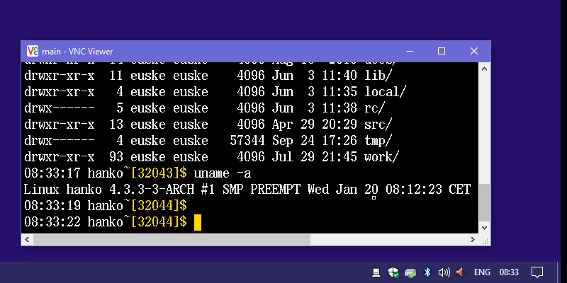

# PyRexecd

PyRexecd is a standalone SSH server for Windows.

## Features:

  * It is just a normal Win32 app (not a service) that resides in the SysTray.
  * For a single user only.
  * Notifies who has just connected.
  * Sends/Receives the clipboard contents via stdin/stdout (text only).
  * Supports public key auth only.

## Prerequisites:

  * Python 3 (or 2)
  * Paramiko (install via pip)
  * PyWin32 - http://sourceforge.net/projects/pywin32/
  * cx_Freeze (optional)

## How to Setup:

  1. Run PyRexec.py. It creates an config directory
     (AppData\Roaming\PyRexecd) and opens it.
  1. Create a new ssh host key via OpenSSH and place it in the config dir.
    `$ ssh-keygen -N '' -f ssh_host_rsa_key`
  1. Copy your public key into the config dir.
    > copy your\id_rsa.pub authorized_keys

## Command Line Sytax:

    > pyrexecd.exe [-d] [-l logfile] [-s sshdir] [-L addr] [-p port]
                   [-u username] [-a authkeys] [-h homedir] [-c cmdexe]
		   hostkeys ...
		   
  * -d : Turns on Debug mode (verbose logging).
  * -l logfile : Log file path (default: pyrexecd.log).
  * -s sshdir : Config directory path. (default: AppData\Roaming\PyRexecd)
  * -p port : Specifies the listen port (default: 2200). 
  * -L a.b.c.d : Specifies the listen address (default: 127.0.0.1).
  * -c cmdexe : cmd.exe path. (default: cmd.exe)
  * -u username : Username.
  * -a authkeys : authorized_keys path. (default: authorized_keys)
  * -h homedir : Home directory path. (default: %UserProfile%)

## How to Build .exe (requires cx_Freeze):

    > python setup.py build
